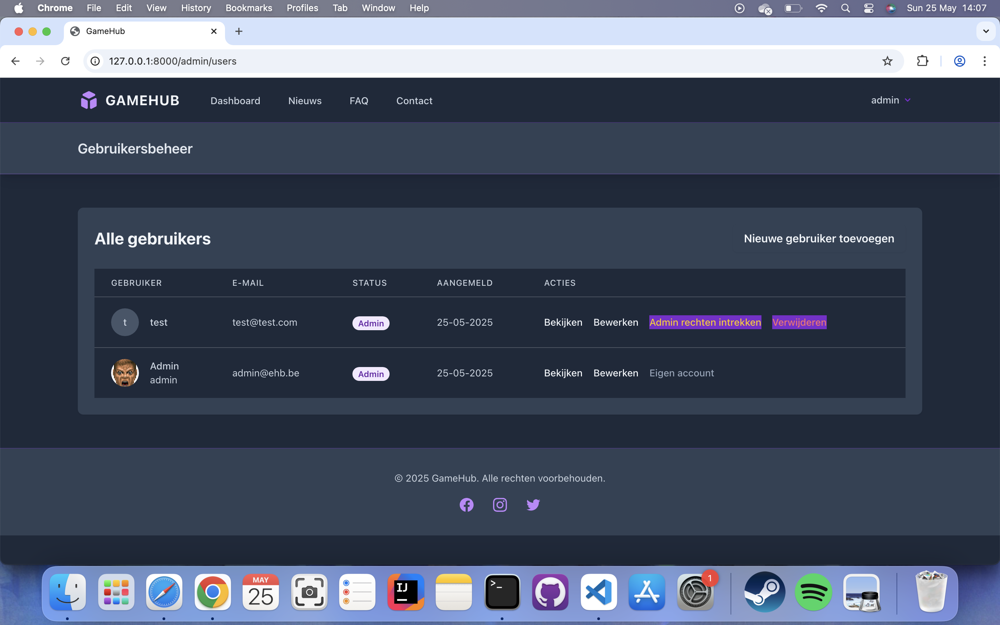
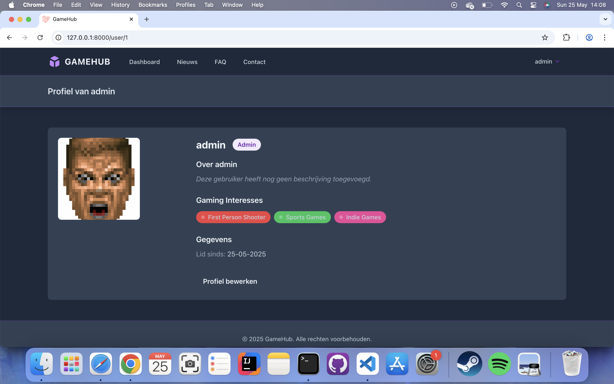
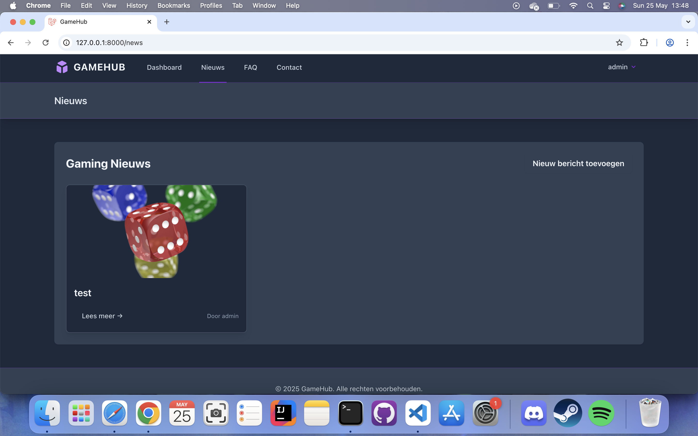

# GameHub - Gaming Community Platform

Een dynamische website gebouwd met Laravel 12 voor de Backend Web eindopdracht. GameHub is een platform voor gaming enthusiasten waar gebruikers nieuws kunnen lezen, FAQ's kunnen raadplegen, hun gaming profiel kunnen delen en actief kunnen deelnemen aan de community via commentaars.

## 📋 Functionaliteiten

### 🔐 Authenticatie & Gebruikersbeheer
- Gebruikersregistratie en login systeem
- Admin en gewone gebruiker rollen
- Admin dashboard voor gebruikersbeheer
- Mogelijkheid voor admins om andere gebruikers admin rechten te geven/afnemen
- Standaard admin account ingebouwd
- Wachtwoord vergeten functionaliteit

### 👤 Profielsysteem
- Publieke profielpagina's voor alle gebruikers
- Persoonlijke profielinstellingen (username, verjaardag, profielfoto, over mij)
- Gaming interesses selecteren en weergeven
- Klikbare gebruikersnamen door de hele applicatie
- Upload en beheer van profielfoto

### 📰 Nieuws Systeem
- Nieuws CRUD functionaliteit voor admins
- Publieke nieuwsweergave voor alle bezoekers
- Afbeelding upload en management
- Auteur informatie met klikbare profielen
- **Commentaar**: gebruikers kunnen reageren op nieuws, replies plaatsen, eigen commentaar bewerken/verwijderen (binnen 15 minuten), admins kunnen alle commentaars verwijderen of bulk verwijderen per nieuwsitem
- Aantal commentaars zichtbaar bij elk nieuwsitem

### ❓ FAQ Systeem
- Categorieën en vragen beheer voor admins
- Uitklapbare FAQ weergave met moderne UI
- Georganiseerd per categorie

### 📧 Contact Systeem
- Contact formulier voor alle bezoekers
- Berichten management voor admins
- Notificatie voor admins.
### 🎮 Gaming Features
- GameInterest systeem voor gebruikersvoorkeuren
- Gaming-themed dark UI design
- Responsive design voor mobiel en desktop

## 🛠 Technische Implementatie

### Models & Database Relaties
- **User Model** (`app/Models/User.php`) - Gebruikersbeheer met gaming interesses
- **NewsItem Model** (`app/Models/NewsItem.php`) - Nieuws artikel beheer  
- **Comment Model** (`app/Models/Comment.php`) - Commentaarsysteem met replies
- **FaqCategory Model** (`app/Models/FaqCategory.php`) - FAQ categorieën
- **FaqQuestion Model** (`app/Models/FaqQuestion.php`) - FAQ vragen en antwoorden
- **GameInterest Model** (`app/Models/GameInterest.php`) - Gaming categorieën
- **ContactMessage Model** (`app/Models/ContactMessage.php`) - Contact berichten

#### Database Relaties:
- **One-to-Many**: User → NewsItem, NewsItem → Comment, FaqCategory → FaqQuestion
- **Many-to-Many**: User ↔ GameInterest (via `user_game_interests` pivot tabel)
- **Self-referencing**: Comment → Comment (replies via `parent_id`)

### Controllers
- **AdminUserController** (`app/Http/Controllers/AdminUserController.php`) - Gebruikersbeheer met veiligheidsmaatregelen
- **NewsItemController** (`app/Http/Controllers/NewsItemController.php`) - Nieuws CRUD operaties
- **CommentController** (`app/Http/Controllers/CommentController.php`) - Commentaar CRUD, replies, bulk delete
- **FaqCategoryController** (`app/Http/Controllers/FaqCategoryController.php`) - FAQ categorieën beheer
- **FaqQuestionController** (`app/Http/Controllers/FaqQuestionController.php`) - FAQ vragen beheer
- **ContactController** (`app/Http/Controllers/ContactController.php`) - Contact formulier handling
- **ProfileController** (`app/Http/Controllers/ProfileController.php`) - Profiel management

### Views & Layout
- **Layouts**: `app-layout` voor ingelogde gebruikers, `guest-layout` voor bezoekers
- **Components**: Herbruikbare navigation, user-link en comments components
- **XSS Protection**: Alle user input wordt geëscaped via Laravel Blade
- **CSRF Protection**: Standaard Laravel CSRF tokens op alle formulieren

### Routes & Middleware
Alle routes zijn georganiseerd in groepen met appropriate middleware:
- **Public routes**: Nieuws, FAQ, Contact (geen authenticatie vereist)
- **Auth routes**: Dashboard, Profiel, reageren op nieuws (authenticatie vereist)
- **Admin routes**: Admin panel, bulk verwijderen van commentaar (authenticatie + admin rol vereist)

## 📁 Project Structuur

```
eindopdracht-laravel/
├── app/
│   ├── Http/
│   │   ├── Controllers/           # Alle controller logica
│   │   ├── Middleware/            # Route middleware
│   ├── Models/                    # Eloquent models
├── database/
│   ├── migrations/                # Database schema's
│   └── seeders/                   # Test data generators
├── public/                        # Publieke bestanden en index.php
├── resources/
│   └── views/                     # Blade templates
│       ├── admin/users/           # Admin gebruikersbeheer
│       ├── admin/contact/         # Admin contactbeheer
│       ├── contact/               # Contact formulieren
│       ├── faq/                   # FAQ pagina's
│       ├── news/                  # Nieuws overzicht en details
│       ├── profile/               # Gebruikersprofielen
│       └── layouts/               # Template layouts
├── routes/
│   └── web.php                    # Web routes
├── storage/                       # Bestanden, logs, cache
├── tests/                         # Unit en feature tests
├── .env                           # Environment configuratie
├── artisan                        # Artisan CLI
├── composer.json                  # Composer dependencies
├── package.json                   # NPM dependencies
└── README.md                      # Project documentatie
```
## 🚀 Installatie

### Vereisten
- PHP >= 8.2
- Composer
- MySQL/MariaDB
- Node.js & NPM

### Installatiestappen

1. **Clone de repository**
```bash
git clone [repository-url]
cd eindopdracht-laravel
```

2. **Installeer dependencies**
```bash
composer install
npm install
```

3. **Environment configuratie**
```bash
cp .env.example .env
php artisan key:generate
```

4. **Database configuratie**
Pas je `.env` bestand aan met je database gegevens:
```env
DB_CONNECTION=mysql
DB_HOST=127.0.0.1
DB_PORT=3306
DB_DATABASE=gamehub
DB_USERNAME=(invullen)
DB_PASSWORD=(invullen)
```

5. **Database setup**
```bash
php artisan migrate:fresh --seed
```

6. **Storage link**
```bash
php artisan storage:link
```

7. **Build assets**
```bash
npm run dev
```

8. **Start de applicatie**
```bash
php artisan serve
```

Bezoek `http://localhost:8000` om de applicatie te bekijken.

## 👨‍💻 Standaard Admin Account

Na het uitvoeren van de seeders is er een standaard admin account beschikbaar:

- **Email**: admin@ehb.be
- **Password**: Password!321
- **Rol**: Administrator

## 📷 Screenshots

### Dashboard
Het hoofddashboard toont een overzicht van alle beschikbare functies met directe links naar nieuws, FAQ en contact.


### Admin Panel - Gebruikersbeheer
Uitgebreid admin panel voor het beheren van gebruikers met mogelijkheid om admin rechten toe te kennen.



### Admin Panel - Contactberichte
Uitgebreid admin panel voor het beheren van berichten.


### Gebruikersprofiel
Publieke profielpagina's tonen gebruikersinformatie, gaming interesses en maken deel uit van de community ervaring.



### Profiel Instellingen
Gaming interesses selectie met verschillende categorieën voor personalisatie.


### Nieuws Systeem
Nieuws overzicht met afbeeldingen, aantal commentaars, publicatiedata en auteur informatie.



### Nieuws Systeem - Commentaar
Commentaar onder de nieuwsberichten (met reacties, replies en mogelijkheid om ze te verwijderen als admin of eigenaar).


### FAQ Systeem
Interactieve FAQ pagina met uitklapbare vragen georganiseerd per categorie.


### Contact Formulier
Clean en gebruiksvriendelijk contact formulier voor gebruikersfeedback.


## 🧩 Technische Vereisten Implementatie

| Vereiste | Implementatie Locatie | Beschrijving |
|----------|----------------------|--------------|
| **Views - Layouts** | `resources/views/layouts/` | App-layout en guest-layout |
| **Views - Components** | `resources/views/components/` | User-link en comments component |
| **XSS Protection** | Alle `.blade.php` files | Laravel Blade auto-escaping |
| **CSRF Protection** | Alle formulieren | `@csrf` directive |
| **Route Middleware** | `routes/web.php` lijnen 15-45 | Auth en admin middleware groepen |
| **Resource Controllers** | `app/Http/Controllers/` | NewsItemController, FaqCategoryController, CommentController |
| **One-to-Many** | `app/Models/User.php` lijn 47 | User → NewsItem relatie |
| **Many-to-Many** | `app/Models/User.php` lijn 52 | User ↔ GameInterest relatie |
| **Migrations** | `database/migrations/` | Alle database schema's |
| **Seeders** | `database/seeders/` | GameInterestSeeder, AdminUserSeeder,TemplateSeeder |

## 🌟 Extra Features

- **Gaming Interesses Systeem**: Gebruikers kunnen hun gaming voorkeuren selecteren
- **Klikbare Gebruikersprofielen**: Community interactie door de hele applicatie
- **Admin Beveiligingen**: Admins kunnen hun eigen rechten niet per ongeluk verwijderen
- **Dark Gaming Theme**: Professionele gaming-geïnspireerde UI
- **Responsive Design**: Werkt op alle apparaten
- **Image Management**: Upload en beheer van profiel- en nieuwsafbeeldingen
- **Commentaar**: Commentaarsysteem waarbij gebruikers met elkaar kunnen spreken onder nieuwsberichten
- **FAQ**: Gebruikers hebbenn de mogelijkheid om de FAQ te vinden. De Admin kan nieuwe categoriën maken en vragen zetten

## 📚 Gebruikte Technologieën

- **Backend**: Laravel 12, PHP 8.2
- **Frontend**: Blade Templates, Tailwind CSS, Alpine.js
- **Database**: MySQL met Eloquent ORM
- **Authentication**: Laravel Breeze
- **File Storage**: Laravel Storage met public disk
- **Styling**: Tailwind CSS met custom gaming theme

## 🔗 Gebruikte Bronnen

- [Laravel Documentation](https://laravel.com/docs)
- [Tailwind CSS Documentation](https://tailwindcss.com/docs)
- [Laravel Breeze](https://laravel.com/docs/starter-kits#laravel-breeze)
- [Alpine.js Documentation](https://alpinejs.dev/)
- AI Assistants:
Claude (Anthropic) voor code review, optimalisatie en debugging (en deze Read me): https://claude.ai/share/1fd2af4a-d9f6-4133-b678-a749337e3f0a en https://claude.ai/chat/52d1451d-a721-4b53-b943-fb17b8ad7a82
GitHub Copilot voor code suggestions, vragen en autocompletion tijdens development

## 👨‍🎓 Auteur

**Naam**: Zakaria Korchi  
**Vak**: Backend Web  
**Academiejaar**: 2024-2025  
**Hogeschool**: Erasmushogeschool Brussel

---